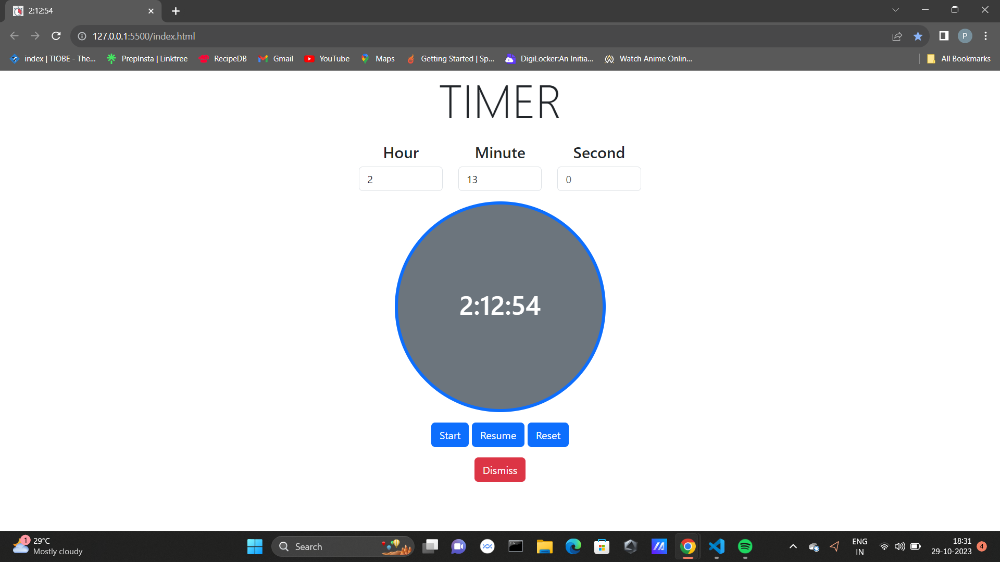

# Timer App



This is a straightforward web-based timer application built using HTML, CSS, JavaScript and Bootstrap. It allows you to set countdown timers with customizable hours, minutes, and seconds. The app provides essential functionality such as starting, stopping, resetting, and dismissing timers. Additionally, it includes an audio notification to alert you when a timer completes.

## Features

- Set countdown timers with hours, minutes, and seconds.
- Start, stop, and reset timers as needed.
- Dismiss timers when they complete.
- Audio notification to alert you when a timer finishes.

## How to Use

1. Enter the desired hours, minutes, and seconds in their respective input fields.
2. Click the "Start" button to begin the timer.
3. Use the "Stop" button to pause the timer if needed.
4. Click "Reset" to reset the timer to 00:00:00.
5. When the timer completes, you can dismiss it using the "Dismiss" button.

## Installation

1. Clone the repository to your local machine:

   ```shell
   git clone https://github.com/yourusername/Timer-App.git
